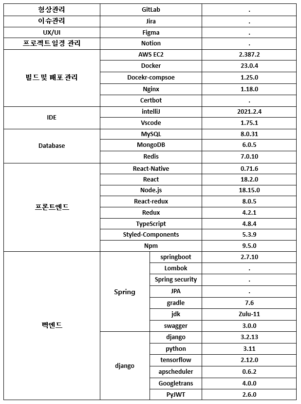
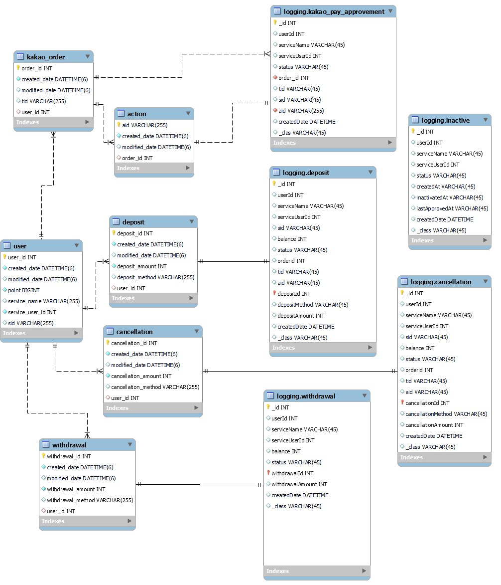

# [A702] Feeling filling - SSAFY 8기 자율 프로젝트

---

## 0.목차

> [1. 프로젝트 개요](#1-프로젝트-개요)
>
> [2. 서비스 및 기능소개](#2-서비스-및-기능소개)
>
> > - [2-1. 사용자의 인풋 값에 대한 감정 분석](#2-1-사용자의-인풋-값에-대한-감정-분석)
> > - [2-2. 감정 분석에 따른 저금 서비스 및 AI의 응답 서비스](#2-2-감정-분석에-따른-저금-서비스-및-ai의-응답-서비스)
> > - [2-3. 나의 달별 저금 기록 조회 및, 월별 추이 조회](#2-3-나의-달별-저금-기록-조회-및-월별-추이-조회)
> > - [2-4. 전체 사용자의 시간 별 저금 추이 조회](#2-4-전체-사용자의-시간-별-저금-추이-조회)
> > - [2-5. 활동을 기반으로한 뱃지 시스템 제공](#2-5-활동을-기반으로한-뱃지-시스템-제공)
>
> [3. 서비스 화면](#3-서비스-화면)
>
> > - [3-1. 로그인 화면](#3-1-로그인-화면)
> > - [3-2. 결제등록 화면](#3-2-결제등록-화면)
> > - [3-3. 홈 화면](#3-3-홈-화면)
> > - [3-4. 메인 채팅창 : 텍스트 전송 및 분석요청](#3-4-메인-채팅창--텍스트-전송-및-분석요청)
> > - [3-5. 메인 채팅창 : 음성 전송 및 분석요청](#3-5-메인-채팅창--음성-전송-및-분석요청)
> > - [3-6. 개인별 맞춤 통계 제공](#3-6-개인별-맞춤-통계-제공)
> > - [3-7. 상세 내역을 월별 조회](#3-7-상세-내역을-월별-조회)
> > - [3-8. 전체 사용자들의 저금 추이, 이달의 저금왕 조회](#3-8-전체-사용자들의-저금-추이-이달의-저금왕-조회)
> > - [3-9. 획득 뱃지 관련 기능](#3-9-획득-뱃지-관련-기능)
>
> [4. 시스템 아키텍쳐](#4-시스템-아키텍쳐)
>
> [5. 개발 환경](#5-개발-환경)
>
> [6. 컴포넌트 구성도 및 Figma](#6-컴포넌트-구성도-및-figma)
>
> > - [6-1. 컴포넌트 구성도](#6-1-컴포넌트-구성도)
> > - [6-2. Figma](#6-2-figma)
>
> [7. ERD](#7-erd)
>
> [8. 서비스 및 기술 특징점](#8-서비스-및-기술-특징점)
>
> [9. 팀원 소개](#9-팀원-소개)

## 1. 프로젝트 개요

- ✔ 프로젝트명: FeelingFilling

- ✔ 한줄 소개: 홧김비용을 홧김저금으로 만들어 드립니다! 사용자가 텍스트, 음성을 기반의 채팅을 전송하면 AI가 감정을 분석해줍니다. 그리고 그에 따른 저금 및 기록, 통계 서비스를 제공합니다. 로그인 및 결제는 카카오 API를 사용합니다.

- ✔ 개발기간: 2023/04/10 - 2023/05/26 (7주)

- ✔ 개발인원: 곽민주 성예빈 김도윤 고명진 김성환 이상훈 (6인)

- ✔ 사용 기술스택: Springboot Django ReactNative Docker AWS +

---

## 2. 서비스 및 기능소개

- ### 2-1. 사용자의 인풋 값에 대한 감정 분석
        사용자는 텍스트, 음성 기반의 채팅을 남길 수 있습니다.
        음성의 경우 업로드 버튼을 누르면 바로 서버로 전송되어 분석됩니다.
        텍스트의 경우에는 분석 대상의 텍스트가 있는 경우 저금하기 버튼이 활성화됩니다.
        활성화된 저금하기 버튼을 누르면 미분석된 텍스트가 분석됩니다.
- ### 2-2. 감정 분석에 따른 저금 서비스 및 AI의 응답 서비스
        사용자가 입력한 텍스트나 음성에 분석될 만큼의 충분한 감정이 들어있다면, 행복/슬픔/분노의 정도를 측정하고 가장 높은 값이 기록됩니다.
        가장 높은 감정의 세기에 따라 미리 등록한 범위의 금액 내에서 저금액이 계산되어 저금됩니다.
        사용자는 분석이 완료되면 저금액과 함께 가장 높게 나온 감정의 종류와 AI의 적절한 응답을 받아볼 수 있습니다.
- ### 2-3. 나의 달별 저금 기록 조회 및, 월별 추이 조회
        홈화면에서 저금 내역을 누르면 달 별 상세 저금 내역을 모두 조회할 수 있습니다. 하단바의 왼쪽 두번째에 위치한 개인 통계 조회창에 들어가면,
        나의 월별 저금 추이를 알아볼 수 있습니다.
        추가로 내가 지금까지 아낀 감정비용으로 몇잔의 커피를 마실 수 있었는지 확인할 수 있으니 재미있게 이용해주세요.
- ### 2-4. 전체 사용자의 시간 별 저금 추이 조회
        하단바의 오른쪽 두번째에 위치한 전체 통계 조회창에 들어가면, 이번달 모든 사용자들의 감정 별 누적 저금 합계를 살펴볼 수 있습니다.
        뿐만아니라 매달 우리 서비스의 저금왕을 뽑아, 이번달 최고 저금액을 알아볼 수 있습니다.
        지금까지 서비스를 이용하며 모인 감정별 총누적 합계도 조회해보세요.
- ### 2-5. 활동을 기반으로한 뱃지 시스템 제공
        성취감을 고취하기 위한 뱃지 시스템을 제공합니다.
        아직 획득하지 않은 뱃지는 "?" 로 표기됩니다.
        서비스를 이용하며 다양한 활동을 해보고, 숨겨져있는 뱃지를 발굴해보세요.

---

## 3. 서비스 화면

- ### 3-1. 로그인 화면
- ### 3-2. 결제등록 화면
- ### 3-3. 홈 화면
- ### 3-4. 메인 채팅창 : 텍스트 전송 및 분석요청
- ### 3-5. 메인 채팅창 : 음성 전송 및 분석요청
- ### 3-6. 개인별 맞춤 통계 제공
- ### 3-7. 상세 내역을 월별 조회
- ### 3-8. 전체 사용자들의 저금 추이, 이달의 저금왕 조회
- ### 3-9. 획득 뱃지 관련 기능

---

## 4. 시스템 아키텍쳐

---

## 5. 개발 환경

---

## 6. 컴포넌트 구성도 및 Figma

- ### 6-1. 컴포넌트 구성도

- ### 6-2. Figma
  

---

## 7. ERD

- ERD (Main server)

- ERD (결제 server)

---

## 8. 서비스 및 기술 특징점

1. 감정을 통해 적금한다는 의미에 맞는 직관적인 이름 Feelingfilling
2. 적금이라는 목적에 부합하는 깔끔한 UI/UX
3. 자동 결제를 위한 카카오 소셜 로그인
4. 민감한 정보인 Billing을 따로 서버를 두고 구현
5. Transformer 기반 학습된 DistilRoBERTa-base NLP 모델 사용
6. Openai 의 ChatGPT 3.5 모델 사용
7. Django 서버 주기적인 작업을 위해 Batch 구현
8. 감정에 따라 분류되어 적금된 금액 확인 가능
9. 사용자당 일별, 월별, 감정별 통계 제공

---

## 9. 팀원 소개

<table>
  <tr> 
    <td align="center"><a href="https://github.com/skyju"> <b>곽민주</b></a> </td>      
    <td align="center"><a href="https://github.com/DooDoo3804"> <b>김도윤</b></a> </td>     
    <td align="center"><a href="https://github.com/e-bing"> <b>성예빈</b></a> </td>
    <td align="center"><a href="https://github.com/m0jinaa"> <b>고명진</b></a> </td>
    <td align="center"><a href="https://github.com/GoldenRetriever-93"> <b>이상훈</b></a> </td>
	<td align="center"><a href="https://github.com/fanngineer"> <b>김성환</b></a> </td>
  </tr>
</table>

### ✔ 곽민주

- 팀장, 주업무 React Native, typescript를 활용한 Android 어플리케이션 개발
- 메인 채팅창, 개인통계, 적립내역, 전체통계 담당
- 뱃지 디자인 담당, 담당한 페이지의 Figma 담당
- Spring에서 Redis를 활용한 refresh token 관리 구현
- React Hook 기능을 사용한 axios에서 refetch부분 작성
- Victory chart를 활용한 데이터 시각화

### ✔ 김도윤

- Docker 및 docker-compose를 통한 프로젝트 빌드 및 배포
- Jenkins를 활용한 CI/CD 구축
- AWS EC2 및 Nginx 서버 관리
- Django framework 로 REST API 구현
- Django-APScheduler로 DJango 서버에 Batch 구현
- Transformer 기반 NLP 모델 적용
- Openai GPT-3.5 model 적용
- 포팅 매뉴얼 문서화

### ✔ 성예빈

- Frontend 개발 환경 세팅 (React Native, TypeScript, Styled Component, Android Studio)
- React Native Navigation 구성 및 화면 설정
- Redux를 사용한 React Native 환경에서의 상태관리
- React Native 환경에서 카카오 로그인 구현
- WebView를 이용한 결제 수단 등록 Frontend 구현
- 일반 Axios 요청, Access Token/Refresh Token 사용한 Axios 요청 Custom hook 작성
- React Native, Android 환경에서 환경 변수 사용 설정
- 랜딩, 회원 가입, 홈 화면, 전체 통계, 마이페이지, 회원 정보 수정, 활동 배지 화면 구성
- Figma 활용 와이어프레임 구성, 로고 및 아이콘 디자인

### ✔ 고명진

- Java 및 SpringBoot를 활용한 Backend REST API 서버 구현
- QueryDsl을 사용한 통계 처리
- Business 서버 Database 구현
- 뱃지 수여를 위한 MySQL trigger 작성

### ✔ 이상훈

- Spring Boot rest api를 활용하여 billing 서버 구축
- MySQL billing database 구축
- MongoDB를 활용한 logging 구현
- Kakao 정기결제 api를 활용한 결제 기능 구현

### ✔ 김성환

- Springboot를 활용한 REST API 서버 구현
-  MongoDB Chatting Database 구축
-  Chatting 기능 관련 로직 구현
-  JWT, Spring Security를 통한 인증/인가
